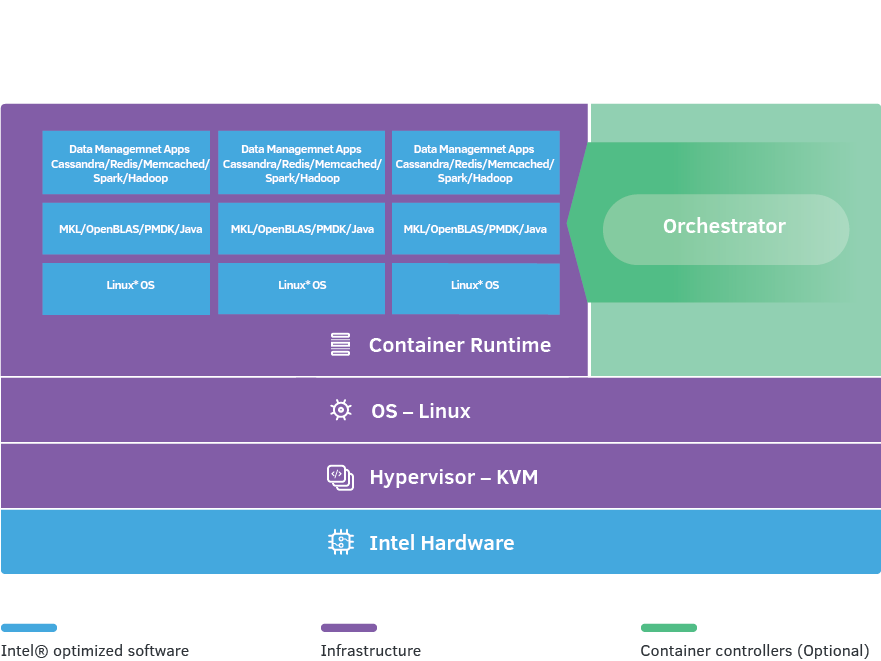

.. _dsrs:

Data Services Reference Stack
#############################
The Data Services Reference Stack (DSRS) combines the best-in-class database and data analytics management apps. Featuring Intel® Optane™ DC persistent memory, DSRS helps you to store and process large amounts of data at unprecedented speeds using a distributed processing framework.

To offer more flexibility, there are multiple versions of the Data Services Reference Stack. Each version includes instructions for using, building and configuring the stack to help get the most out of it.

Overview
********

.. toctree::
   :maxdepth: 1

   README.md
   terms_of_use.md

Apache Spark* versions
======================

.. toctree::
   :maxdepth: 1

   spark/README.md

memcached* versions
===================

.. toctree::
   :maxdepth: 1

   memcached/README.md

Redis* versions
===============

.. toctree::
  :maxdepth: 1

  redis/README.md

Apache Cassandra* versions
==========================

.. toctree::
  :maxdepth: 1

  cassandra/README.md

Previous Releases
*****************

DSRS is built on the foundation of the previously released Database Reference Stack (DBRS) and the Data Analaytics Reference Stack (DARS). These stacks remain available for reference, but new work should take adavantage of the DSRS options.

.. toctree::
   :maxdepth: 1

   ../dbrs/index
   ../dars/index
