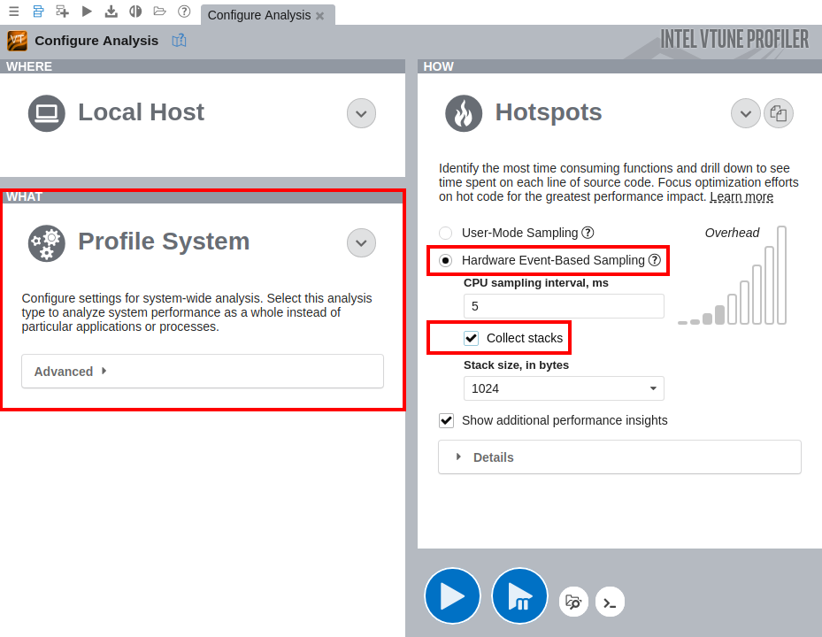

# HPCRS Tutorial -- Creating an Environment for Running Workloads

In this tutorial we will walk through the steps to setup an environment for running workloads with the  High Performance Computing Reference Stack (HPCRS), using Kubernetes*, MPI*, and the HPCRS image with QE* in a HPC cloud environment.

We have tested these instructions with the following hardware and software configurations. This tutorial uses networking information like IP addresses that reflects our test network.  Please update these instructions to reflect your network setup.

## Hardware Configuration

* Intel® Xeon® Gold 6252 CPU running at 2.10GHz
* 2 sockets and 24 cores per socket

We tested with 3 nodes in our cluster:
* Kubernetes master
* Kubernetes workers (2)


## Software Prerequisites

For each of the three nodes in the cluster:

OS: We used [CentOS 8](https://www.centos.org) for all three nodes.

1. Setup ssh access without password.
For details refer to https://www.ibm.com/support/pages/configuring-ssh-login-without-password  
2. Install Kubernetes (v1.19.2) and Docker* (v19.03.12). 
Refer to https://www.tecmint.com/install-a-kubernetes-cluster-on-centos-8/  
3. Install cri-o (v1.19.0). 
Refer to https://computingforgeeks.com/install-cri-o-container-runtime-on-centos-linux/ 

## Software Configuration

On each node:

1. Configure Kubernetes to enable IP forwarding 

  Ensure `net.ipv4.ip_forward` is set to "1" in the `/etc/sysctl.d/60-k8s.conf` file.  You may need to create this file if it does not exist.

  ```
    #cat /etc/sysctl.d/60-k8s.conf 
    net.ipv4.ip_forward = 1 
  ```

2. Restart systmctl to pick up the change:  

  ```
    #systemctl restart systemd-sysctl

  ```

3. Disable swap  
`#swapoff -a`

4. Configure the /etc/hosts file for all nodes  
`#echo "127.0.0.1 localhost <hostname>" >> /etc/hosts`

5. Add the IP address and corresponding hostname to /etc/hosts for all 3 nodes.
Replace `<x.x.x.x>` with the IP addresses specific to your setup.
```
#tail -3 /etc/hosts
  <x.x.x.x> node1
  <x.x.x.x> node2
  <x.x.x.x> node3
```

6. Setup Docker and cri-o proxy for all nodes  
```
#cat /etc/systemd/system/docker.service.d/proxy.conf 
[Service] 
Environment="HTTP_PROXY=<your proxy if needed>" 
Environment="HTTPS_PROXY=<your proxy if needed>" 
Environment="NO_PROXY=192.168.0.0/16,10.0.0.0/8,localhost,127.0.0.0/8,<your network specific addresses>
#cat /etc/sysconfig/crio 
HTTP_PROXY=<your proxy if needed>
HTTPS_PROXY=<your proxy if needed>
NO_PROXY=i192.168.0.0/16,10.0.0.0/8,localhost,127.0.0.0/8,<your network specific addresses>"
```

7. Setup the Docker registry on which we host the HPCRS image (HPCRS:ICC + QE installed), and from which Kubernetes will deploy the latest image.  
```
#cat /etc/containers/registries.conf 
#master will also act as local registry, add below to bypass insecure error  
[registries.insecure] 
registries = ["<your registry IP address>:5000"]
```

8. Configure kubelet for the correct CPU policy
```
#cat /etc/sysconfig/kubelet 
KUBELET_EXTRA_ARGS=--cgroup-driver=systemd  --cpu-manager-policy=static --kube-reserved=cpu=1,memory=2Gi,ephemeral-storage=1Gi --system-reserved=cpu=1,memory=2Gi,ephemeral-storage=1Gi
```

9. Restart and enable all related services  
```
#systemctl restart crio 
#systemctl restart docker 
#systemctl restart kubelet
```
 
## Configuring the Kubernetes master


1. Install podman (v1.6.4)  
`#dnf install podman`

2. Install helm (v3.3.4).  Follow the instructions at
https://www.techrepublic.com/article/how-to-install-the-kubernetes-package-manager-helm/

3. Setup the local registry for the cri image

4. Setup the local registry on the master node, and download the HPCRS stack image:  
```
#docker pull docker.io/registry 
#docker run -d -p 5000:5000 --name=registry --restart=always --privileged=true  --log-driver=none -v /registery:/tmp/registry registry 
#docker pull <your registry address or url>/sysstacks/hpcrs-centos:v0.2.0
```

5. Modify the Dockerfile to add QE based on the HPCRS stack image  
`# vi Dockerfile
From <your registry url>/sysstacks/hpcrs-centos:v0.2.0`

## Add and Build QE
For details on QE refer to: https://hpc-forge.cineca.it/files/gara_tier_1/public/Benchmark-Instructions.txt.

1. Add the following to your Dockerfile to build the image:

```
From <x.x.x.x>:5000/hpcrstest:test

#Proxy Settings
ARG proxy=<your proxy if needed>
ENV http_proxy=$proxy  
ENV https_proxy=$proxy  

#Install ssh and Generate ssh Host Keys
RUN yum update --disablerepo=intel-graphics --disablerepo=oneAPI -y && yum install --disablerepo=intel-graphics --disablerepo=oneAPI -y openssh-server
COPY ssh-entrypoint.sh /bin/ssh-entrypoint.sh
RUN chmod +x /bin/ssh-entrypoint.sh
RUN ssh-entrypoint.sh

#Fix ssh Login Issue
RUN usermod -p ! root
RUN mkdir -p /etc/ssh/
RUN echo "Port 2022" > /etc/ssh/sshd_config
```

2. Create the cri image based on HPCRS in the registry  
```
  #cd image  
   #podman build -t hpcrstestcri:cri --build-arg proxy=$http_proxy -f Dockerfile . 
   #podman push hpcrstestcri:cri --tls-verify=false docker://localhost:5000/hpcrstestcri:cri
```   

3. Copy the config to the root user directory and install flannel  

```
   #mkdir -p $HOME/.kube && cp /etc/kubernetes/admin.conf $HOME/.kube/config  
   #kubectl apply -f https://raw.githubusercontent.com/coreos/flannel/master/Documentation/kube-flannel.yml
```


4. Init the Kubernetes cluster  
```
  #kubeadm reset --cri-socket=/run/crio/crio.sock -f 
  #kubeadm init --apiserver-advertise-address <x.x.x.x> --pod-network-cidr <x.x.x.x>/16 --cri-socket=/run/crio/crio.sock --ignore-preflight-errors=SystemVerification --token-ttl=0
```


5. Record the last command in the log, which will be used to join workers to the Kubernetes cluster, such as:  
```
kubeadm init --apiserver-advertise-address <your network address> --pod-network-cidr <your network address>/16 --cri-socket=/run/crio/crio.sock --ignore-preflight-errors=SystemVerification --token-ttl=0
```

6. Run the following commands on each worker to join the cluster:  
```
#kubeadm join <your network address>:6443 --token tceoji.65vxsvcv8z5vzce2 --discovery-token-ca-cert-hash sha256:d4b3848ff2d5a242b63037687351805abb7abecc8a260e77905ca61d9d077758
```
>NOTE:
>
>Make sure the time is aligned across worker and master nodes, checking with the Linux  `#date` command.


## Run  QE on the HPCRS image
All commands are run on the Kubernetes master node.  


```
  #export NAMESPACE=helm
  #kubectl delete namespace ${NAMESPACE}
  #kubectl create namespace ${NAMESPACE}
  #SECRET=hpc-secret
  #mkdir -p .tmp
  #yes | ssh-keygen -N "" -f .tmp/id_rsa -C ""
  #kubectl delete secret ${SECRET} -n ${NAMESPACE} || true
  #kubectl create secret generic ${SECRET} -n ${NAMESPACE} --from-file=id_rsa=.tmp/id_rsa --from-file=id_rsa.pub=.tmp/id_rsa.pub --from-file=authorized_keys=.tmp/id_rsa.pub
  #kubectl config set-context --current --namespace=$NAMESPACE
  #helm template --values ./values.yaml hpc ./horovod > debug.yml
  #kubectl apply -f debug.yml --validate=false
```


QE will be triggered and you can check the logs through these commands:
```
#kubectl get pods 
[root@a4bf0157a8d7 k8s]# kubectl get pods
NAME            	READY   STATUS	RESTARTS   AGE
hpc-horovod-0   	1/1 	Running   0      	2m8s
hpc-horovod-zzxdx   1/1 	Running   2      	2m8s
```
Check the logs of a specific pod with this command:

```
#kubectl logs -f hpc-horovod-zzxdx  
+ sleep 5 
+ mkdir -p /root/.ssh 
+ rm -f /root/.ssh/config 
+ touch /root/.ssh/config 
+ '[' true == true ']' 
+ set +e 
+ yes 
+ cp /etc/secret-volume/id_rsa /root/.ssh/id_rsa 
+ yes 
+ cp /etc/secret-volume/authorized_keys /root/.ssh/authorized_keys 
+ set -e 
+ '[' -n 32222 ']' 
+ echo 'Port 32222' 
+ sed -i 's/^Port.*/Port 32222 /g' /etc/ssh/sshd_config 
+ echo 'StrictHostKeyChecking no' 
+ /usr/sbin/sshd 
+ runCheckSSH /horovod/generated/hostfile 
++ cat /horovod/generated/hostfile 
++ awk '{print $(1)}' 
+ for i in `cat $1 | awk '{print $(1)}'` 
+ [[ <x.x.x.x> != *\m\a\s\t\e\r ]] 
+ retry 30 ssh -o ConnectTimeout=2 -q <x.x.x.x> exit 
+ local n=0 
+ local try=30 
+ local 'cmd=ssh -o ConnectTimeout=2 -q <x.x.x.x> exit' 
+ [[ 7 -le 1 ]] 
+ set +e 
+ [[ 0 -ge 30 ]] 
+ ssh -o ConnectTimeout=2 -q <x.x.x.x> exit 
+ break 
+ ssh -o ConnectTimeout=2 -q <x.x.x.x> exit 
+ '[' 0 -ne 0 ']' 
+ set -e 
+ for i in `cat $1 | awk '{print $(1)}'` 
+ [[ 10.165.9.31 != *\m\a\s\t\e\r ]] 
+ retry 30 ssh -o ConnectTimeout=2 -q <x.x.x.x> exit 
+ local n=0 
+ local try=30 
+ local 'cmd=ssh -o ConnectTimeout=2 -q <x.x.x.x> exit' 
+ [[ 7 -le 1 ]] 
+ set +e 
+ [[ 0 -ge 30 ]] 
+ ssh -o ConnectTimeout=2 -q <x.x.x.x> exit 
+ break 
+ ssh -o ConnectTimeout=2 -q <x.x.x.x> exit 
+ '[' 0 -ne 0 ']' 
+ set -e 
+ '[' 0 -ne 0 ']' 
+ '[' 1 -eq 0 ']' 
+ bash -c 'cd /root/benchmarks/AUSURF112/ && source /opt/intel/bin/compilervars.sh intel64 && mpir 24 --hostfile /horovod/generated/hostfile -genv I_MPI_DEBUG 4 -genv I_MPI_PIN_DOMAIN omp -genv I_h -genv OMP_PROC_BIND CLOSE -genv OMP_PLACES threads -genv OMP_NUM_THREADS 2 /root/q-e/bin/pw.x -iAUSURF112/ausurf.in -npool 2
```

After running the workload, it will output the performance data, for example:
`PWSCF : 1m52.95s CPU 0m32.17s WALL`

## PyTorch benchmarks

This section describes running the [PyTorch
benchmarks](https://github.com/pytorch/benchmark) for Caffe2 in single node.

1. Pull the image:

   `docker pull sysstacks/hpcrs-centos`

   ---
   NOTE:

      If you are on a network with outbound proxies, be sure to configure Docker
      to allow access. See the [Docker service
      proxy](https://docs.docker.com/config/daemon/systemd/#httphttps-proxy) and
      [Docker client
      proxy](https://docs.docker.com/network/proxy/#configure-the-docker-client)
      documentation for more details.

   ---

2. Run the image with Docker:

   `docker run --name <image name>  --rm -i -t sysstacks/hpcrs-centos /bin/bash`

   ---
   NOTE:

   Launching the Docker image with the `-i` argument starts
   interactive mode within the container. Enter the following commands in
   the running container.

   ---

3. Navigate to to where Pytorch and Caffe are installed:

   `cd /usr/lib/python3.8/site-packages/caffe2/python/`

4. Install dependencies for the benchmark:

   ```bash
   pip install protobuf
   pip install future
   ```

5. Execute the benchmark script:

   ```bash
   python convnet_benchmarks.py --batch_size 32 \
                                --cpu \
                                --model AlexNet
   ```

## Using DCP++

Data Parallel C++ (DPC++) is a high-level language designed for data parallel programming productivity. A sample file is included to show how to use DPC++ with the HPCRS image.

To test DPC++:

```bash
clang++ -I $DPCPP_ROOT/include/sycl test_dpcpp.cpp -L $DPCPP_ROOT/lib -fsycl
./a.out
```

If running on a CPU, the program will compile and an this output is expected:

```bash
  test dpcpp platform-1 device-1 ...
  Non-GPU device
```


## Using Spack* to list available recipes

Spack is a program manager for supercomputers, Linux and macOS, and is included in the HPCRS image. Using Spack in the HPCRS image is straighforward.

1. Pull the image:

   `docker pull sysstacks/hpcrs-centos`

   ---
   NOTE:

      If you are on a network with outbound proxies, be sure to configure Docker
      to allow access. See the [Docker service
      proxy](https://docs.docker.com/config/daemon/systemd/#httphttps-proxy) and
      [Docker client
      proxy](https://docs.docker.com/network/proxy/#configure-the-docker-client)
      documentation for more details.

   ---

2. Run the image with Docker, launching in interactive mode with the `-i` flag:

   `docker run --name <image name>  --rm -i -t sysstacks/hpcrs-centos /bin/bash`

3. Run the following at the bash prompt:

   ```bash
   # to list available recipes:
   > spack list
   # to get info on a specific recipe, use `spack info`:
   > spack info zlib
   # to install a recipe:
   > spack install zlib
   ```


## HPCRS and the Intel® VTune™ Profiler

Intel® VTune™ Profiler allows you to profile applications running in Docker* containers, including profiling multiple containers simultaneously. More information about VTune Profiler is available at [software.intel.com](https://software.intel.com/content/www/us/en/develop/documentation/vtune-cookbook/top/configuration-recipes/profiling-in-docker-container.html)

### Prerequisites

This section of the tutorial assumes the following prerequisites are met

* Intel VTune Profiler 2020
* Linux* container runtime: docker.io
* Operating System on host: Ubuntu* or CentOS with Linux kernel version 4.10 or newer
* Intel(r) microarchitecture code named Skylake with 8 logical CPUs

1. Pull the image onto the VTune enabled system:

   `docker pull sysstacks/hpcrs-centos`


2. Run the container and keep it running with the `-t` and `-d` options

   `docker run --name <image name>  -td <sysstacks/hpcrs-centos>`

3. Find the container ID with the `docker ps` command

   ```
     host> docker ps
    CONTAINER ID        IMAGE               COMMAND    CREATED                  STATUS              PORTS               NAMES
      98fec14f0c08        hpcrs_test        "/bin/bash" 10 seconds ago      Up 9 seconds                          
    ```

4. Use the container ID to ensure bash is running in the background

    `docker exec -it 98fec14f0c08  /bin/bash`

### Use VTune to collect and analyze data

1. Launch the VTune Profiler on the host, for example:

   ```
   host> cd /opt/intel/vtune_profiler
   host> source ./vtune-vars.sh
   host> vtune-gui
   ```   
2. Create a project for your analysis in VTune, for example: `python-benchmark`

3. Run an application within the HPCRS container

   For example, run the python benchmarks as shown above

4. On the **Configure Analysis** tab in VTune, configure the following options:

    * On the **WHAT** pane, select the **Profile System** target type
    * Select the **Hardware Event-Based Sampling** mode
    * On the **HOW** pane, enable stack collection

   

5. Click **Start** to run the analysis.

You can also profile Docker containers using the Attach to Process target type, but you will only be able to profile a single container at a time.

For more information on Intel VTune Profiler capabilites, refer to the [Intel® VTune™ Profiler Performance Analysis Cookbook](https://software.intel.com/content/www/us/en/develop/documentation/vtune-cookbook/top.html)     
