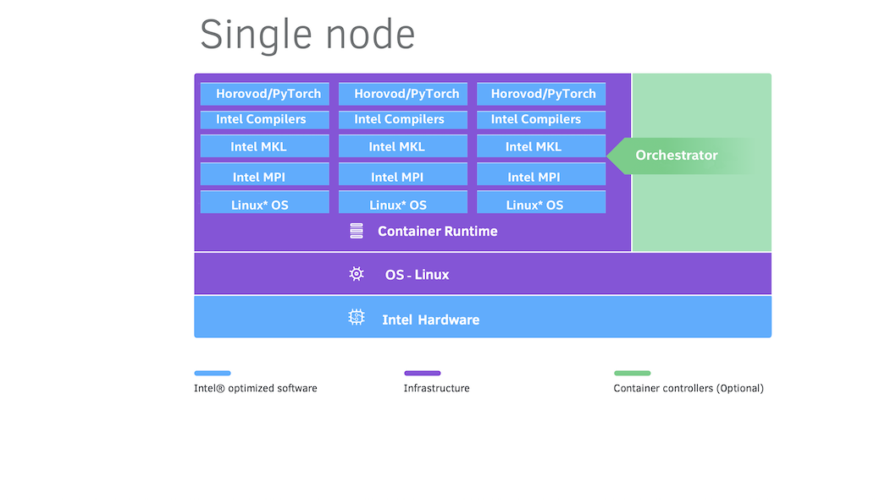

.. _hpcrs:

High Performance Computing Reference Stack
##########################################

The High Performance Computing Reference Stack (HPCRS) meets the needs of deploying HPC and AI workloads on the same system. This software solution reduces the complexities associated with integrating software components for High Performance Computing (HPC) workloads.

Overview
********

.. toctree::
   :maxdepth: 1

   README.md
   NEWS.md
   terms_of_use.md

Guides
******

   .. toctree::
      :maxdepth: 1

      d2s/Readme.md
      docs/FAQ.md
